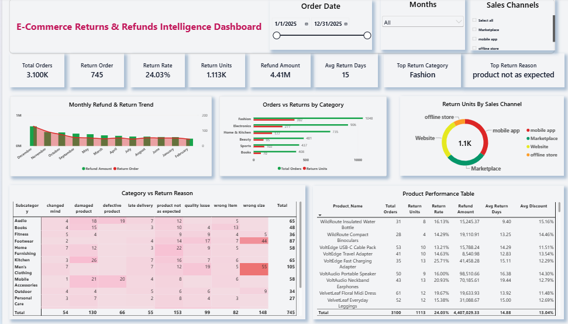

# E-Commerce Returns & Refunds Intelligence Dashboard 📊

An interactive **Power BI dashboard** designed to analyze e-commerce returns, refunds, return rates, customer return reasons, sales channels, and product performance.

## 📌 Project Overview

Returns and refunds are important factors in e-commerce because they can affect revenue, customer satisfaction, inventory, and overall business performance.

This project transforms raw e-commerce returns and refunds data into an interactive dashboard that helps identify return patterns, high-return categories, common return reasons, refund exposure, and product-level performance.

## 🎯 Objectives

- Analyze total orders and return orders
- Calculate and monitor return rate
- Track returned units and refund amounts
- Identify the top-returning product category
- Identify the most common return reason
- Analyze returns across different sales channels
- Monitor monthly return and refund trends
- Evaluate product-level return performance
- Provide interactive filters for deeper analysis

## 📊 Dashboard KPIs

- **Total Orders**
- **Return Orders**
- **Return Rate**
- **Return Units**
- **Refund Amount**
- **Average Return Days**
- **Top Return Category**
- **Top Return Reason**

## 📈 Dashboard Features

### Monthly Refund & Return Trend
Analyzes refund amounts and return orders across different months to identify trends over time.

### Orders vs Returns by Category
Compares total orders and returned units across product categories to highlight categories with higher return activity.

### Return Units by Sales Channel
Analyzes returned units across different sales channels, including Marketplace, Mobile App, Website, and Offline Store.

### Category vs Return Reason
Uses a matrix with conditional formatting to identify the relationship between product categories and customer return reasons.

### Product Return Performance
Provides product-level details including total orders, return units, return rate, refund amount, average return days, and average discount.

## 🎛️ Interactive Filters

The dashboard includes interactive slicers for:

- Order Date
- Month
- Sales Channel

These filters allow users to explore return and refund performance dynamically.

## 🛠️ Tools & Technologies

- Microsoft Power BI
- DAX
- Power Query
- Microsoft Excel
- Data Cleaning & Transformation
- Data Visualization
- Business Intelligence

## 🔄 Data Process

1. Imported the raw e-commerce dataset into Power BI
2. Cleaned and transformed the data using Power Query
3. Created calculated measures using DAX
4. Developed KPI cards and analytical visuals
5. Added interactive slicers and conditional formatting
6. Designed and formatted the dashboard
7. Validated calculations and visual results

## 💡 Key Insights

The dashboard provides insights into:

- Overall return performance
- Return rates and returned units
- Financial impact of refunds
- High-return product categories
- Common customer return reasons
- Sales channels with higher return activity
- Products with higher return rates
- Category and return-reason patterns

## 📂 Project Files

| File | Description |
|------|-------------|
| `Dashboard.pbix` | Power BI dashboard |
| `Dashboard.pdf` | PDF version of the dashboard |
| `Dashboard.png` | Dashboard preview |
| `Ecommerce_Returns_Refunds_Raw_Dataset_2025.xlsx` | Raw dataset |
| `README.md` | Project documentation |

## 📷 Dashboard Preview

## 📄 Dashboard Report

A PDF version of the completed dashboard is included in the repository for easy viewing.

**Dashboard PDF:** `Dashboard.pdf`

The `.pbix` file is also included for users who want to explore the interactive dashboard in Power BI Desktop.

## 📚 Learning Outcomes

Through this project, I developed practical skills in:

- Power BI Dashboard Development
- DAX
- Power Query
- Data Cleaning
- Data Transformation
- KPI Development
- Data Visualization
- Business Intelligence
- Dashboard Design
- Data Storytelling

## 👩‍💻 Author

**Muskan Adnan**

Data Science Student | Aspiring Data Scientist

**Skills:** Power BI • DAX • Power Query • Python • Data Analysis • Data Visualization • Business Intelligence

## 📌 Project Context

This project was developed as part of my practical **Data Science learning journey at Techma Zone**, focusing on applying data visualization and business intelligence techniques to a real-world e-commerce scenario.

---

⭐ If you found this project useful, feel free to explore the repository and connect with me!